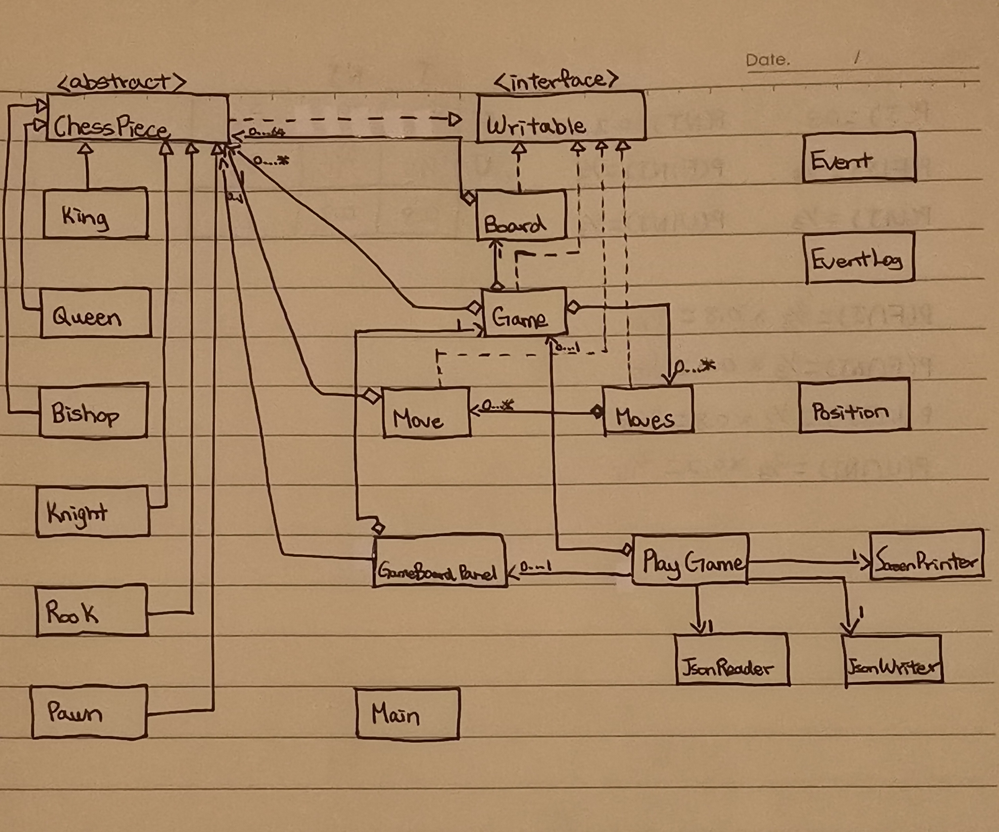

# CPSC210 Personal Project Proposal (Chess-1.0) -  Kent Chen

For the term project, I am planning to design a chess game application. 
The game will include all chess figures, and each side will have:
- 1 *King*
- 1 *Queen*
- 2 *Bishops*
- 2 *Knights*
- 2 *Rooks*
- 8 *Pawns*

This application has limited functions: 
- it **CAN** be used by players who want to play against themselves,
- it **CAN** be used by players who want to play against others (on the same device),
- but it **CANNOT** be used by players who want to play against robots,
- and it **CANNOT** be used by players who want to play one game using more than one device.
- it covers the majority of rules in a formal chess game, but there are some rules that are omitted (e.g. draw
by three-fold repetition, draw by insufficient material).

This project is of interest to me because chess is one of the board games that I favour
and that I am familiar with. The chess figures have complicated rules regarding movements (e.g., the castling move), 
which brings numerous challenges to the designing process. Nevertheless, I believe that the overall experience will be
fun and rewarding.

## User Story

- As a user, I want to be able to know the possible moves for each of my chess pieces when it is my turn to move
- As a user, I want to be able to move one of my chess pieces when it is my turn to move
- As a user, I want to be able to take back my last move
- As a user, I want to be able to promote my pawn to a Queen, a Rook, a Bishop, or a Knight of my choice when it reaches 
the opposite end of the board
- As a user, I want to be able to know when my King is checked (my King will be attacked)
- As a user, I want to be able to know when my King is checkmated (my King will be attacked but there is nothing I can 
do) and the game is over
- As a user, I want to be able to know when a stalemate occurs (my King is not checked but there are no legal moves that
I can make) and the game is over
- As a user, I want to be able to see the results when game is over (i.e., who wins?)
- As a user, I want to be able to add chess pieces on a board to design my own game
- As a user, I want to be able to save my unfinished game
- As a user, I want to be able to load my unfinished game

## Phase 4: Task 2

## Phase 4: Task 3

- Several methods in the ui package could be moved to the model package
- PlayGame class performs several unrelated functions (e.g. processing different types of chess moves, 
letting users create their own game), which could be refactored into several classes
- Game class performs several unrelated functions (e.g. modifying chess board, determining whether checkmate, 
stalemate exist), which could be refactored into several classes
- PlayGame class consists of many button fields, which could be reduced or transform into local variables if methods
related to buttons are designed differently
- The chessListToJson method in the Board class is also used in Game class. Instead of calling this method in Game from 
a Board variable, I could create an interface and have the two classes implementing that interface so that they can share
this functionality
- Make more uses of the Position class

## References:

- UBC. AlarmSystem. Retrieved November 26, 2021 from https://github.students.cs.ubc.ca/CPSC210/AlarmSystem
- UBC. JsonSerializationDemo. Retrieved November 26, 2021 from 
https://github.students.cs.ubc.ca/CPSC210/JsonSerializationDemo
- Vexels. 2017. Queen chess figure white. (January 2017). Retrieved November 26, 2021 from 
https://www.vexels.com/png-svg/preview/143217/queen-chess-figure-white
- Vexels. 2019. King chess piece. (January 2019). Retrieved November 26, 2021 from 
https://www.vexels.com/png-svg/preview/166404/king-chess-piece 

